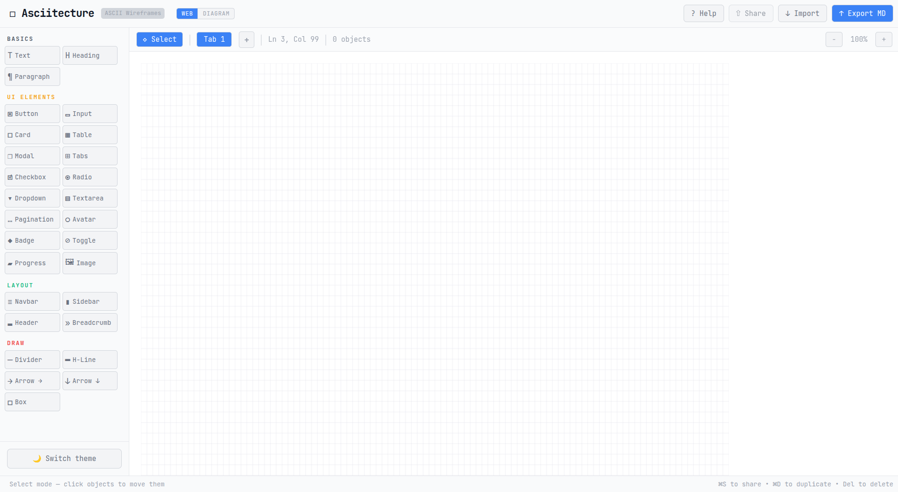

# Asciitecture

> AI-friendly ASCII wireframe editor for designing mockups that both humans and AI can understand.

<p align="center">
  
  
  
</p>

<p align="center">
  
</p>

## ✨ Features

- 🎨 **Visual Editor** - Drag and drop ASCII components
- 🤖 **AI-Friendly** - Export designs that AI coding assistants can implement
- 🌓 **Light/Dark Themes** - Comfortable viewing with theme toggle (default: light)
- 🔄 **Dual Modes** - Switch between WEB (UI components) and DIAGRAM (flowcharts)
- 📑 **Tabbed Interface** - Work on up to 3 designs simultaneously
- 💾 **Auto-Save** - Never lose your work with automatic local storage
- 📋 **Markdown Export** - Copy and paste into Claude, ChatGPT, or any AI tool
- ⌨️ **Keyboard Shortcuts** - Fast workflow with intuitive shortcuts
- 📱 **Responsive** - Works on any screen size

## 🚀 Quick Start

```bash
# Clone the repository
git clone https://github.com/yourusername/Asciitecture.io.git
cd Asciitecture.io

# Install dependencies
pnpm install    # Recommended

# Copy environment variables
cp .env.example .env

# Start the development server
pnpm dev
```

Open [http://localhost:3000](http://localhost:3000) and start designing!

## 🎯 Usage

1. **Choose a mode** - WEB for UI mockups, DIAGRAM for flowcharts
2. **Select a component** from the left panel
3. **Click on the canvas** to place it
4. **Drag to reposition** objects
5. **Double-click tabs** to rename them (when tabs are enabled)
6. **Export as Markdown** to use with AI tools

## ⌨️ Keyboard Shortcuts

- `Delete` / `Backspace` - Delete selected object
- `Escape` - Deselect / Close dialogs
- `Cmd/Ctrl + D` - Duplicate selected object  
- `Cmd/Ctrl + S` - Share design via URL (coming soon)

## 🎨 Modes

### WEB Mode
UI components for web/app mockups:
- Forms (inputs, buttons, checkboxes)
- Layout (cards, modals, navigation)
- Data display (tables, lists, badges)

### DIAGRAM Mode
Diagramming tools for technical documentation:
- Shapes (boxes, diamonds, circles)
- Connectors (arrows, lines)
- Annotations (labels, comments)
- Containers (swimlanes, groups)

## ⚙️ Configuration

### Environment Variables

Create a `.env` file (copy from `.env.example`):

```bash
# Feature flags
VITE_FEATURE_TABS=true    # Enable/disable tab functionality
```

### Feature Flags

- **Tabs**: Set `VITE_FEATURE_TABS=false` to disable the tabbed interface

## 🚀 Performance Monitoring

For development, you can add performance measurements:

```javascript
// Add to App.jsx for click-to-render metrics
const perfMeasure = (label, callback) => {
  if (import.meta.env.DEV) {
    performance.mark(`${label}-start`);
    callback();
    
    requestAnimationFrame(() => {
      performance.mark(`${label}-end`);
      performance.measure(label, `${label}-start`, `${label}-end`);
      const measure = performance.getEntriesByName(label)[0];
      console.log(`⚡ ${label}: ${measure.duration.toFixed(2)}ms`);
    });
  } else {
    callback();
  }
};
```

## 🤖 AI Integration

### For AI Assistants

When users ask for wireframes, generate ASCII art like this:

```
┌─────────────────────────┐
│      Contact Form       │
├─────────────────────────┤
│ Name:                   │
│ ┌─────────────────────┐ │
│ └─────────────────────┘ │
│                         │
│ Email:                  │
│ ┌─────────────────────┐ │
│ └─────────────────────┘ │
│                         │
│  ┌────────┐ ┌────────┐ │
│  │ Submit │ │ Cancel │ │
│  └────────┘ └────────┘ │
└─────────────────────────┘
```

Users can then import this directly into Asciitecture!

### For Developers

Use our AI-friendly template functions:

```javascript
import { ai } from './lib/ai-templates';
import { aiDiagram } from './lib/ai-diagram-templates';

// Create UI components
const button = ai.button("Click me");
const form = ai.form("Contact", ["Name", "Email"]);

// Create diagrams
const flowchart = aiDiagram.flowchart(["Start", "Process", "End"]);
const erd = aiDiagram.erd({
  User: ["id", "name", "email"],
  Post: ["id", "user_id", "title"]
});
```

See [AI_GUIDE.md](./AI_GUIDE.md) for complete documentation.

## 🛠️ Tech Stack

- **React 18** - UI library
- **Vite 5** - Lightning fast build tool
- **No other runtime dependencies** - Seriously!

## 📦 Project Structure

```
Asciitecture.io/
├── src/
│   ├── App.jsx                    # Main editor component
│   ├── lib/
│   │   ├── templates.js           # WEB mode components
│   │   ├── diagram-templates.js   # DIAGRAM mode components
│   │   ├── ai-templates.js        # AI-friendly UI generators
│   │   ├── ai-diagram-templates.js # AI-friendly diagram generators
│   │   ├── storage.js             # Local storage & URL sharing
│   │   └── export.js              # Export utilities
│   └── main.jsx                   # App entry point
├── .env.example                   # Environment variables template
├── AI_GUIDE.md                    # Guide for AI assistants
└── README.md                      # You are here!
```

## 🎨 Available Components

### WEB Mode
- **Forms**: Buttons, Inputs, Textareas, Checkboxes, Radio buttons
- **Layout**: Cards, Modals, Navigation, Sidebars, Headers
- **Display**: Tables, Lists, Progress bars, Badges, Toggles

### DIAGRAM Mode
- **Shapes**: Boxes, Diamonds, Circles, Cylinders
- **Connectors**: Arrows (→ ← ↔ ↓ ↑), Lines, Dashed lines
- **Annotations**: Labels, Comments, Notes, Numbers
- **Containers**: Dotted boxes, Swimlanes, Clouds, Entities

## 🤝 Contributing

Contributions are welcome! Feel free to:

- Report bugs
- Suggest new features
- Add new ASCII components
- Improve AI integration

## 📄 License

MIT License - feel free to use this in your projects!

## 🙏 Acknowledgments

Inspired by:
- [excalidraw](https://excalidraw.com) - For the elegant simplicity
- [oat.ink](https://oat.ink) - For the theme toggle placement
- [ASCIIFlow](https://asciiflow.com) - For ASCII art inspiration

---

Made with ❤️ for developers and AI assistants everywhere